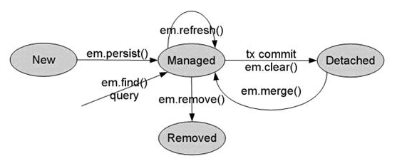

# spring-data-jpa


## Idea

- .var: assign variable
- .new: new instance
- sout: system out
- 右方 Maven Tab 可以看各個專案的依賴關係
- ctrl + alt + L: auto format
- alt + / : Code completion
- ctrl + shift + space : code suggestion
  - some completion may not be provided on Community Edition
- ctrl + /: comment


## Lec 04、JPA 的介紹及 JDBC 的關係

- JDBC 和 JPA 都是一種規範，JDBC 由各個關聯式資料庫(MySQL、Oracle、...) 來實現，也就是開發時所引入的 driver jar 檔

- JPA 是由 ORM 框架 (全自動) 實現

  > MyBatis 是半自動 ORM 框架，甚至嚴格來說都不能算 ORM 框架
  >
  > MyBatis 其實只是對 JDBC 做簡單的封裝而已

- 全自動 ORM 框架最主流的是 Hibernate

- JDBC 用 SQL 語句操作 SQL

- JPA 用 OOP 的方式操作 DB，通過 ORM 框架生成 SQL

  e.g xxx.find -> SELECT，xxx.remove -> DELETE

  前提是要建立好 ORM Mapping

  > Java Class (attribute) <-> RDBMS TABLE (column/field)

- 開發人員可以不用會 SQL，由 JPA 充當翻譯器
- JPA 資料庫移植性較高，例如 MySQL 和 Oracle 分頁語法不同，要轉換很麻煩


## Lec 05、JPA、Hibernate、MyBatis 關係

- JPA (Java/Jarkata Persistence API)，是 Sun 官方在 JDK 1.5 提出的**一種 ORM 規範**，O: Object、R: Relational、M: Mapping

  > Jarkata 簡單說是 Oracle 法律上不讓 Eclipse 基金會使用 Java 所衍生出的別名
  >
  > https://www.ithome.com.tw/news/133034

  - 簡化持久化操作的開發，讓開發者從 SQL 代碼中解脫，面向對象操作
  - Sun 希望持久化技術統一，實現天下歸一，基於 JPA 進行持久化操作可以任意切換資料庫

- JPA 支持 XML 與 註解兩種元數據映射、提供基礎 API 與 JPQL

- JPA 僅是一種規範，也就是只定義了接口(interface)，而接口需要實現才能 work

- 而 JPA 的實現就是俗稱的 ORM 框架，如 Hibernate(最主流)、...

  - Spring boot 默認的 JPA 實現也是 Hibernate

- Hibernate V.S. MyBatis 

  - MyBatis: 小巧、方便、高效、簡單、直接、半自動

    - 半自動的 ORM 框架: 因為需要自己寫 SQL，與 JPA 對 ORM 框架的定義(用面向對象的方式進行操作)有差異，嚴格來說都不能算 ORM 框架
    - 小巧: MyBatis 就是 JDBC 封裝，再加上 緩存、動態 SQL 等等功能
    - 方便: 因為還是得寫 SQL，方便性來說要打個問號，但若是用 MyBatis-plus，有提供一些基本的 CRUD，就比較方便
    - 在中國較流行，因為系統邏輯較偏複雜，例如有的審核系統一個 SQL 幾百行...
    - 使用場景: 在業務比較複雜的系統使用
    - 學習成本較低

  - Hibernate: 強大、方便、高效、複雜、繞彎子、全自動

    - 全自動的 ORM 框架
    - 強大: 根據 ORM 映射生成不同 SQL
    - 複雜: 當業務邏輯複雜時套用不易
    - 在歐美較流行，狠甩 MyBatis 幾條街
    - 使用場景: 在業務相對簡單的系統使用

    > Q: 既然 Hibernate 業務複雜時難用，學習成本又高，那為什麼還要用?
    >
    > A: 隨著微服務的流行，Spring Data 也逐漸嶄露頭角被廣為使用。(微服務的精神是"拆"，把系統功能拆的越細越好，數據庫也會跟隨著進行拆分，例如商品表單獨拆放一個 DB，訂單表單獨拆放一個 DB，用戶相關再另外放一個 DB，此時對單一商品數據庫一般就不太會寫到複雜 SQL 了，比較會是分開查商品 DB 和訂單 DB 再返回資料給前端使用者，SQL 語句也就簡化了)

## Lec 06、Hibernate & JPA 快速搭建

- Spring Data JPA 也是依賴 Hibernate，所以就沒有辦法拒絕學習 Hibernate 囉

  要用 Spring Data JPA 就必須學 Hibernate

- 父 Maven 項目主要是用來管理子項目和公共依賴，不會有程式代碼(src 目錄)

- Hibernate 編程思想中是不需要手動創建 Table 的，它叫做 Code First 代碼先行，與傳統先設計表的 DB First 不同。只需要關注 POJO 類，Hibernate 會透過 POJO 類生成表 (但數據庫要自行手動創建)

> ### Idea
>
> - File/New/Project -> Maven -> Next -> 設定 Artifact coordinate -> Finish
>
> - 刪除 src 目錄
> - 專案右鍵 -> New/Module/Maven -> Next -> 設定 Artifact coordinate -> Finish

- javax.persistence-api-2.2.jar 是 JPA 依賴，內部定義的基本上都是接口，所以只依賴這個的話就沒有實現類，不能進行持久化操作。所以說 JPA 只定義規範這件事從這個 jar 就看的出來。

## Lec 07、基於 Hibernate 數據庫持久化操作

testC 執行 log

```
二月 07, 2022 12:04:22 上午 org.hibernate.resource.transaction.backend.jdbc.internal.DdlTransactionIsolatorNonJtaImpl getIsolatedConnection
INFO: HHH10001501: Connection obtained from JdbcConnectionAccess [org.hibernate.engine.jdbc.env.internal.JdbcEnvironmentInitiator$ConnectionProviderJdbcConnectionAccess@7f4037ed] for (non-JTA) DDL execution was not in auto-commit mode; the Connection 'local transaction' will be committed and the Connection will be set into auto-commit mode.
Hibernate: 
    
    create table cst_customer (
       cust_id bigint not null auto_increment,
        cust_address varchar(255),
        cust_name varchar(255),
        primary key (cust_id)
    ) engine=InnoDB
二月 07, 2022 12:04:22 上午 org.hibernate.engine.transaction.jta.platform.internal.JtaPlatformInitiator initiateService
INFO: HHH000490: Using JtaPlatform implementation: [org.hibernate.engine.transaction.jta.platform.internal.NoJtaPlatform]
Hibernate: 
    insert 
    into
        cst_customer
        (cust_address, cust_name) 
    values
        (?, ?)

Process finished with exit code 0
```


- HQL是基於 JPQL 的擴充(更加強大)，例如可以再執行一些 SQL 函數、支持 JPQL 不支持的 INSERT 等等。 
  - 詳細可參考 Hibernate 官網文件
    - 文件內 `[]` 中括號的意思表示可寫可不寫
  - Spring Data JPA 也可以使用 HQL。


## Lec 08、基於 JPA 數據庫持久化操作

- 將 SSH 中的 Hibernate 替換成 JPA，有利於未來 實現類的切換

- 如果有接觸到 Spring Data JPA 的源碼，就會看到 EntityManager、Persistence 等 JPA API 的操作

  若實際運行會發現這些 API 底層實現也還是 Hibernate

- JPA 未提供單獨的 update 方法，想硬性規定只做 update 要自己寫 JPQL

  insert 的話要看 JPA 的實現類是否支持 (Hibernate 支持)

- 若真的有實際業務場景必須寫 SQL 也是可以的

- 無法刪除游離狀態的實例 (涉及 JPA 對象四大狀態觀念)，只能刪除持久化狀態的對象 (必須從數據庫里查出來的才是持久化對象)

  ```java
  ...
  Customer customer = new Customer();
  customer.setCustId(5L);
  
  entityManager.remove(customer);
  ...
  
  java.lang.IllegalArgumentException: Removing a detached instance org.example.pojo.Customer#5
  ```

  只能先查再刪的話，否則要寫 JPQL

  ```
  ...
  Customer customer = entityManager.find(Customer.class, 5L);
  entityManager.remove(customer);
  ...
  ```


## Lec 09、JPA 對象的四種狀態和緩存

TODO: 所以 JPA/Hibernate 將物件狀態設計成這樣的邏輯主要考量為何? 優勢在哪?


> Spring Data JPA 是在 JPA 的基礎上進行實現，如果項目開發中不了解 JPA 的這些特性。很容易陷入莫名奇妙更新數據庫或不更新數據庫等問題。


### JPA 對象的四種狀態

> **JPA entity lifecycle**: 
>
> - [JPA Entity lifecycle – JPA developer should know](https://javabydeveloper.com/jpa-entity-lifecycle-jpa-developer-should-know/)
> - https://matthung0807.blogspot.com/2018/06/hibernate-jpa-entity-jpa-entity.html
> - https://blog.csdn.net/yingxiake/article/details/50968059



- 臨時狀態: 剛創建(new)出來，尚未與 entityManager 發生關係，沒有被持久話，不在 entityManager 中的對象

- 持久狀態: 與 entityManager 發生關係，已經被持久化，可以把持久化狀態視為實實在在的數據庫記錄 (若對數據庫記錄修改則會進行同步)

  > 持久狀態下即使未呼叫 merge 之類的 API，一旦事務提交，仍然會執行 UPDATE
  >
  > 所以這也是我們必須好好理解這四種狀態關係的原因

- 刪除狀態: 執行 remove 方法，事務提交之前

- 游離狀態: 事務 commit 到數據庫後實體的狀態。因為事務已經提交了，此時實體的屬性改變也不會同步到數據庫。游離是沒人管的孩子，不在持久化上下文中。

  - 也就是說即使對象在數據庫中有對應的資料，但如果沒有和 entityManager 產生關聯，那就是一個游離狀態。


### JPA 緩存

- 基本上就是 Hibernate 緩存，因為是由 Hibernate 來實現的

  - 一級緩存: 同一個 entityManager 對象底下，同樣的查詢只會查一次 DB。也就是查完第一次 DB 之後都從緩存中獲取數據。

  - 二級緩存: 屬於應用級別，那怕是不同 entityManager 也只會查一次。後面一樣從緩存取得

  - 詳細不介紹，需要另外再深入去看 Hibernate。

    二級緩存一般不太會用到。

    一級緩存則需要知道一下，因為用不用不是你來決定XD 只要你在同一個 entityManager 下進行相同查詢默認就會用到


## Lec 10、Spring Data JPA 介紹

> 正式進入主軸，前 9 講屬於開胃菜(先備知識)


https://spring.io/projects/spring-data-jpa

Spring Data JPA, part of the larger Spring Data family, makes it easy to easily implement JPA based repositories. This module deals with enhanced support for JPA based data access layers. It makes it easier to build Spring-powered applications that use data access technologies.

Implementing a data access layer of an application has been cumbersome for quite a while. Too much boilerplate code has to be written to execute simple queries as well as perform pagination, and auditing. **Spring Data JPA aims to significantly improve the implementation of data access layers by reducing the effort to the amount that’s actually needed.** (Spring Data JPA 旨在改進數據訪問層的實現以提升開發效率) As a developer you write your repository interfaces, including custom finder methods, and Spring will provide the implementation automatically.


更簡單地說,

- Spring Data JPA 是 Spring 提供的一套框架，用來簡化 JPA 的開發 (例如不需再重複撰寫 entityManager 創建、 transaction commit 等代碼)。
- 依照約定好的規則進行 方法命名 去寫 DAO 層接口則可以不寫實現數據庫的訪問與操作。(https://docs.spring.io/spring-data/jpa/docs/current/reference/html/#jpa.query-methods)
- 提供除了 CRUD 以外的功能，如分頁、排序、複雜查詢等等
- 讓我們解脫了 DAO 層的操作，基本上所有 CRUD 都可以依賴它來實現。實際的開發中推薦使用 Spring Data JPA + ORM (如 Hibernate) ，未來若切換不同 ORM 框架也更方便，且對數據庫層的操作也更簡單，易於解耦。


### Features

- Sophisticated support to build repositories based on Spring and JPA
- Support for [Querydsl](http://www.querydsl.com/) predicates and thus type-safe JPA queries
- Transparent auditing of domain class
- Pagination support, dynamic query execution, ability to integrate custom data access code
- Validation of `@Query` annotated queries at bootstrap time
- Support for XML based entity mapping
- JavaConfig based repository configuration by introducing `@EnableJpaRepositories`.


上述特性講起來其實有點囉嗦，有些實際感受過才能體會，簡單來說就是 Spring Data JPA 極大地簡化了 DAO 層的代碼，我們只需要寫接口就**自動**具有了 CRUD、分頁查詢等方法，牛逼!


> Spring Data JPA 本質是利用了 JDK 的動態代理將 原生  JPA 包了一層而已
>
> > 如果動態代理是什麼不懂的話，最好額外自行去補充一下這種基礎知識!!!
> >
> > - https://www.gushiciku.cn/pl/glln/zh-tw
> > - https://www.liaoxuefeng.com/wiki/1252599548343744/1264804593397984


TODO: 架構圖


## Lec 11、Spring data JPA 搭建 XML 的配置方式

> 不建議直接創建 spring boot 項目來學習 Spring data，因為 spring boot 的自動配置類會幫你做好很多 Bean 的配置，我們會不知道到底 Spring data 需要配置那些 Bean，你會成為一個傻瓜式的 spring boot programmer
>
> P.S. 一定要知道 spring boot 幫我們配置了什麼，以後才能在 spring boot 的基礎上進行擴展。如果這些都不知道要談何擴展，更別說要去看懂它底層的一些源碼了。
>
> 自己去配置一遍，才能熟悉整體的體系，對未來才有實質幫助。


- 參照官方說明(https://docs.spring.io/spring-data/jpa/docs/current/reference/html/#dependencies)添加依賴

  使用 spring-data-bom 統一管理所有 spring-data 子項目的版本可以避免未來一些版本衝突。

- 純 spring-data 項目要另外添加 Hibernate 依賴，Spring boot 默認 JPA 實現才是 Hibernate

- spring-test: 整合 Spring 項目的單元測試

- 連接池: 管理 Data Source、druid: 德魯伊

  - https://blog.csdn.net/hailongcsdn/article/details/106223821
    - 什麼是連接池？
      連接池是一種創建和管理連接的緩衝池技術，這些連接已經準備好被其他的線程進行調用。
    - 那為什麼要使用連接池呢？
      我們知道，連接的創建和銷毀時需要時間的，而連接池就是在服務器初始化的時候，創建好一些連接，然後把它們放到內存中的連接池裡，使用的時候，可以直接從內存中獲取。使用完成又歸還給連接池。這樣從內存中獲取和歸還連接的效率，遠遠高高每次連接的創建和銷毀，**大大提高了服務器的性能**，所以使用連接池是很用必要的。
  - https://www.gushiciku.cn/pl/gb9z/zh-tw
  - https://kknews.cc/zh-tw/code/nlr2k93.html

- 使用 XML 配置 spring

  - 官網的配置說明
    - 使用 XML https://docs.spring.io/spring-data/jpa/docs/current/reference/html/#jpa.namespace
    - 使用 Java Config https://docs.spring.io/spring-data/jpa/docs/current/reference/html/#jpa.java-config
  - https://www.itread01.com/content/1549220976.html
  - JPA 整合 Spring 概念是把 JPA 基本的 API (例如 EntityManagerFactory) 交給 Spring 來管理


> 要會使用 一手資料(官方文檔) 來學習，而非 二手資料 (別人再整理過的)，因為官方始終會更新

## Lec 12、Spring data JPA 的 CRUD 測試

## Lec 13、Spring data JPA 的 Java Config 配置方式

## Lec 14、使用 Spring data Repositories

- XML 和 Java Config 使用上擇一即可。

  Spring boot 幾乎全是 Java Config 且據說 Spring 6 會捨棄 XML 配置方式。

  兩種配置方式基本上都要掌握，因為一般公司還是有一些 SSM 項目會用到 XML 配置，

  若不太懂 Java Config 可以去找老師的 Spring 課程。

- 雖然 Spring boot 會自動幫你配好，但還是建議自己配一遍，到時候使用 Spring boot 或看源碼都會加清晰。

  

Spring data Repository 抽象的目標是顯著減少各種持久性存儲實現數據訪問層所需的樣板代碼量

### CrudRepository

```java
// 用來插入和修改，有主鍵就是修改 沒有就是新增
// 根據返回值獲取插入後的自增ID
<S extends T> S save(S entity);

// 通過集合保存多個實體
<S extends T> Iterable<S> saveAll(Iterable<S> entities);

// 通過主鍵查詢實體。 泛型 ID 就是繼承 CrudRepository 時給定的主鍵類別
Optional<T> findById(ID id);

// 通過主鍵查詢是否存在，返回 boolean
boolean existsById(ID id);

// 查詢所有
Iterable<T> findAll();

// 通過集合主鍵查詢多個實體，返回集合
Iterable<T> findAllById(Iterable<ID> ids);

// 查詢總數量
long count();

// 根據 ID 進行刪除
void deleteById(ID id);

// 根據 實體 進行刪除
void delete(T entity);

// 依 ID 刪除多個
void deleteAllById(Iterable<? extends ID> ids);

// 依 實體 刪除多個
void deleteAll(Iterable<? extends T> entities);

// 刪除全部
void deleteAll();
```

### PagingAndSortingRepository

具有分頁和排序的能力

- using the type-safe API: https://docs.spring.io/spring-data/jpa/docs/current/reference/html/#repositories.paging-and-sorting


## Lec 15、自定義操作 - JPQL 和 SQL

> Idea 插件 JPA Buddy 可提示 JPQL

- JPQL (原生 SQL)

  - @Query

    - 查詢如果返回單個實體用 POJO 接收，如果是多個需要通過集合

    - 參數設置方式

      - 索引 `?數字`
      - 具名 `:參數名`，結合 @Param 註解指定參數名稱

    - 增刪改

      - 要加上事務的支持

        ```java
        // 通常在 Service 層聲明
        @Transactional
        // 通知 Spring Data JPA 是 `增刪改` 的操作
        @Modifying
        ```

      - 如果是插入方法，一定只能在 Hibernate 下才支持

        JPQL 本身不支持新增，但 Hibernate 的實現支持一種偽新增 (INSERT INTO SELECT ...)

        https://docs.jboss.org/hibernate/stable/orm/userguide/html_single/Hibernate_User_Guide.html#hql-insert

## Lec 16、自定義操作 - 規定方法名

- 規定方法名

  - 支持的查詢方法 - 主題關鍵字(前綴) / Supported query method subject keywords
    - 只有查詢和刪除
    - 決定當前方法作用
    - https://docs.spring.io/spring-data/jpa/docs/current/reference/html/#repository-query-keywords

  - 支持的查詢方法 - 謂詞關鍵字和修飾符 / Supported query method predicate keywords and modifiers
    - 決定查詢條件
    - https://docs.spring.io/spring-data/jpa/docs/current/reference/html/#appendix.query.method.predicate
  - 再怎麼樣支持的條件和主題都是有限的，所以透過規定方法名來執行持久化操作只能做一些默認、簡單的 CRUD，尚不足以滿足實務需求。

## Lec 17、自定義操作 - Query By Example

> 前兩講的做法都不能實現動態條件查詢
>
> Query By Example、Specifications、Querydsl 三種方式可以實現
>
> 然而三者皆有各自的應用場景與限制，沒有完美的QQ

- Query By Example
  - 只能實現一些簡單的查詢
  - 只支持查詢
    - 不支持嵌套或分組的屬性約束，如 firstname=?0 OR (firstname=?1 AND firstname=?2)
    - **只支持字串** start/contains/ends/regex 匹配和其他屬性類型的**精確**匹配
      - 例如有日期範圍的查詢就不能用
      - 無法實現 `>、<、>=、<=、IN、BETWEEN` 等非精確匹配的條件查詢
      - 如果所有動態條件都只是字串，可使用 Query By Example
  - https://docs.spring.io/spring-data/jpa/docs/current/reference/html/#query-by-example
  - 條件匹配器: https://docs.spring.io/spring-data/jpa/docs/current/reference/html/#query-by-example.matchers
    - ExampleMatcher 中定義許多靜態方法，可以對條件進行一些行為上的設置，例如 with 開頭的
- interface MatcherConfiguer<T>... 
  - interface 如果只有一個方法通常稱為函數接口，可以結合 java 8 lambda expression 使用

## Lec 19、自定義操作 - Specifications

- 通過 Specifications
  - Query By Example 只能針對字串進行條件設置，如果想支持所有類型，可使用 Specifications

### 實現

繼承 interface JpaSpecificationExecutor<T>


Specification<T>

- Root: 相當於 FROM Customer，通過 root 來獲取 `列` 的字段
- CriteriaQuery: 查詢哪些字段，排序為何。用來組合 (ORDER BY、WHERE)
- CriteriaBuilder: 相當於 WHERE，用來設置各種條件 (>、<、IN、...)
- Predicate (Expression): 每個查詢條件的詳細描述

> #### 發現寫了過於複雜的查詢條件?
>
> 畢竟 Spring Data JPA 本身的定位不是為了複雜查詢而生
> 所以我們需要因應不同業務場景來挑選對應的技術
> 一般複雜業務場景的系統目前還是選 MyBatis，實現起來較簡單
> 如果系統微服務之類是拆分過、較簡單的表，就不太會有太複雜的功能
> 另外一般微服務架構下的購物網站，動態條件查詢背後也會用搜尋引擎如 Elasticsearch。
> (如果你的程式出現過多這樣的複雜查詢的場景，說明你的技術選型錯了!)

### 限制

不能實現分組、聚合函數，得自己透過 entityManger 做。


TODO: 

query 有 groupBy、multiselect 等方法，但老師卻說沒用，底層被定死。這段聽不懂

toPredicate 方法中的三個參數和自己用 entityManager 取到的又有何不同?

```java
@Autowired
EntityManager entityManager;

@Test
public void test00() {
    CriteriaBuilder criteriaBuilder = entityManager.getCriteriaBuilder();
    CriteriaQuery<Object> query = criteriaBuilder.createQuery();
    Root<Customer> from = query.from(Customer.class);
}
```


## Lec 18、自定義操作 - QueryDSL

- DSL means Domain Specific Language. https://discuss.elastic.co/t/what-is-dsl-stands-for-in-query-dsl/32635
- http://querydsl.com/
- 通過 Querydsl
  - 通過 Specification 實現的動態條件查詢有點麻煩且可讀性不高。 QueryDsl 可讀性較佳。
  - QueryDsl 是一個獨立的第三方框架，不屬於 JPA 規範之中，也不屬於 Hibernate、Spring
  - QueryDsl是基於ORM框架或SQL平台上的一個**通用查詢框架**
    - 可在任何支持的項目以通用的 API 方式來構建查詢
    - 主要集成 JPA，此外也支持 JDO、SQL、MongoDB 等等
    - 是 JPQL 和 Criteria 查詢的替代方案
    - https://blog.csdn.net/qq_38974638/article/details/120275354

- 需要另外繼承 QuerydslPredicateExecutor，但不可以去掉原本的 CrudRepository 或 PagingAndSorting

- QuerydslPredicateExecutor 使用到外部依賴 com.querydsl.core 的 class，所以要另外引入依賴

  ```xml
  <querydsl.version>5.0.0</querydsl.version>
  
  		<dependency>
              <groupId>com.querydsl</groupId>
              <artifactId>querydsl-jpa</artifactId>
              <version>${querydsl.version}</version>
          </dependency>
  ```

  

- https://docs.spring.io/spring-data/jpa/docs/current/reference/html/#core.extensions

  - 官網範例中直接使用 user.firstname 在原生 entity 是不支援的 (但官網完全沒提XD)

    所以要另外引入 querydsl-apt 與 maven 插件在 <outputDirectory> 下生成 QEntity

    ```xml
            <apt.version>1.1.3</apt.version>
            
            <dependency>
                <groupId>com.querydsl</groupId>
                <artifactId>querydsl-apt</artifactId>
                <version>${querydsl.version}</version>
                <scope>provided</scope>
            </dependency>
            
        <build>
            <plugins>
                <plugin>
                    <groupId>com.mysema.maven</groupId>
                    <artifactId>apt-maven-plugin</artifactId>
                    <version>${apt.version}</version>
                    <executions>
                        <execution>
                            <phase>generate-sources</phase>
                            <goals>
                                <goal>process</goal>
                            </goals>
                            <configuration>
                                <outputDirectory>target/generated-sources/queries</outputDirectory>
                                <processor>com.querydsl.apt.jpa.JPAAnnotationProcessor</processor>
                            </configuration>
                        </execution>
                    </executions>
                </plugin>
            </plugins>
        </build>
    ```

    

  - 觸發 mvn compile 後，apt-maven-plugin 就會幫我們生成 Query Entity 到 target/generated-sources/queries 下

    ```
    [INFO] Scanning for projects...
    [INFO] 
    [INFO] -------------------< org.example:02-spring-data-jpa >-------------------
    [INFO] Building 02-spring-data-jpa 1.0-SNAPSHOT
    [INFO] --------------------------------[ jar ]---------------------------------
    [INFO] 
    [INFO] --- apt-maven-plugin:1.1.3:process (default) @ 02-spring-data-jpa ---
    [INFO] 
    [INFO] --- maven-resources-plugin:2.6:resources (default-resources) @ 02-spring-data-jpa ---
    [WARNING] Using platform encoding (UTF-8 actually) to copy filtered resources, i.e. build is platform dependent!
    [INFO] Copying 1 resource
    [INFO] 
    [INFO] --- maven-compiler-plugin:3.1:compile (default-compile) @ 02-spring-data-jpa ---
    [INFO] Changes detected - recompiling the module!
    [WARNING] File encoding has not been set, using platform encoding UTF-8, i.e. build is platform dependent!
    [INFO] Compiling 8 source files to D:\Lawrence\learning\java\spring-data-jpa_tuling\spring-data\02-spring-data-jpa\target\classes
    [INFO] ------------------------------------------------------------------------
    [INFO] BUILD SUCCESS
    [INFO] ------------------------------------------------------------------------
    [INFO] Total time:  5.035 s
    [INFO] Finished at: 2022-02-08T14:27:47+08:00
    [INFO] ------------------------------------------------------------------------
    ```

    

  - 且需要將 target/generated-sources/queries 改為 sources 目錄 IDE 才可正常編譯


## Lec 20、自定義操作 - QueryDSL 動態查詢 & 原生查詢

- TODO: 分組、聚合函數 一樣只能用原生 entityManger ?


## Lec 21、多表關聯: 一對一代碼搭建

- JPA 多表關聯也是規範，實現依然是 Hibernate，所以這邊學的關聯操作依然是 Hibernate 的關聯操作
- 學過 Hibernate 的基本上可以跳過，因為 Spring data JPA 在這塊基本上沒有任何擴展
- 所以說要找一些官方說明的話就需要去 Hibernate 的官網看，Spring data JPA 官網在關聯關係沒有任何說明
  - https://docs.jboss.org/hibernate/stable/orm/userguide/html_single/Hibernate_User_Guide.html#associations

- 實際開發上肯定會涉及到許多多表關聯操作的
  - mybatis 或 mybatis-plus 在多表關聯都需要自己寫 SQL 且定義欄位映射關係
  - JPA/Hibernate 透過註解定義關聯關係，基本上操作主表，子表就會對應幫你做
    - 例如 insert customer 同時會幫你 insert account
    - 老師是說更方便，但我個人是覺得這樣 debug 更複雜啦...


### 一對一

- e.g 客戶表 - 帳戶表
- 通過外鍵關聯兩表

- 配置關聯關係

  - Customer 中加入 Account 或 Account 中加入 Customer : 單向關聯

    ```java
    // 單向關聯 一對一
    @OneToOne
    // 設置外鍵的字段名
    @JoinColumn(name = "account_id")
    private Account account;
    ```

  - 或是兩個都加: 形成雙向關聯

- 配置關聯操作

  ```java
  @OneToOne(cascade = CascadeType.PERSIST)
  ```

  - 未配置會出錯

    ```java
    org.springframework.dao.InvalidDataAccessApiUsageException: org.hibernate.TransientPropertyValueException: object references an unsaved transient instance - save the transient instance before flushing : org.example.pojo.Customer.account -> org.example.pojo.Account; nested exception is java.lang.IllegalStateException: org.hibernate.TransientPropertyValueException: object references an unsaved transient instance - save the transient instance before flushing : org.example.pojo.Customer.account -> org.example.pojo.Account
    ```

## Lec 22、多表關聯: 單向一對一

## Lec 23、多表關聯: 雙向一對一

## Lec 24、多表關聯: 一對多

## Lec 25、多表關聯: 多對一

## Lec 27、多表關聯: 多對多-關聯插入

## Lec 28、多表關聯: 插入已保存關聯數據

## Lec 26、多表關聯: 多對多-查詢、刪除

- https://docs.jboss.org/hibernate/stable/orm/userguide/html_single/Hibernate_User_Guide.html#associations-many-to-many

  > For `@ManyToMany` associations, the `REMOVE` entity state transition doesn’t make sense to be cascaded because it will propagate beyond the link table. Since the other side might be referenced by other entities on the parent-side, the automatic removal might end up in a `ConstraintViolationException`.
  >
  > For example, if `@ManyToMany(cascade = CascadeType.ALL)` was defined and the first person would be deleted, Hibernate would throw an exception because another person is still associated with the address that’s being deleted.

## Lec 29、樂觀鎖

- JPA 的樂觀鎖 (Optimistic Lock) 也是屬於 Hibernate 的

  > Hibernate 裡面還有其他許多知識點，樂觀鎖只是其中之一。有興趣可以再去完整學 Hibernate 

- 只需要在屬性前加上 @Version 註解，實現非常簡單(P.S. 無論是在 MyBatis-plus or Hibernate)

  ```java
  private @Version Long version
  ```

- 用途: 

  - 防併發修改: 防止同時有不同人(線程)對共享數據進行讀寫導致數據錯亂

    - 例如一帳戶原有 1000 元，兩人同時開始提款， A 提 200 (剩餘 800)、B 提 500 (剩餘 500)，A 先完成 (更新為800) B 後完成(更新為500) 最後帳戶記載剩餘 500，A 提的 200 就丟失了

  - 通常以 CAS 的機制實現，在表中加一個**版本 (version)**標記，初始是 0。操作過程中再拿出來進行比較

    - A、B 開始時得到 ver=0

      A 完成後發現 account.ver = A.ver = 0，將 account.ver 更新為 1。餘額更新為800

      B 完成後發現 account.ver = 1 與 B.ver = 0 不符，就會拋出異常來防止併發修改。

## Lec 30、審計

- https://docs.spring.io/spring-data/jpa/docs/current/reference/html/#auditing

- database auditing

  - 資料庫稽核(審計): 指在資料庫系統中，記錄使用者在何時做了那些動作，俾據以查核。
    - https://terms.naer.edu.tw/detail/1276287/
    - https://www.sqlshack.com/a-quick-overview-of-database-audit-in-sql/

- 阿里巴巴開發手冊規定建表須定義創建者、創建時間、修改者、修改時間

  - https://github.com/aihua/alibaba-p3c/blob/master/%E9%98%BF%E9%87%8C%E5%B7%B4%E5%B7%B4Java%E5%BC%80%E5%8F%91%E6%89%8B%E5%86%8C%EF%BC%88%E8%AF%A6%E5%B0%BD%E7%89%88%EF%BC%89.pdf

  - https://www.w3cschool.cn/alibaba_java/

    > 主要查到的資料只提到 創建時間、修改時間。
    >
    > 但可能是因為 阿里巴巴開發手冊 也一直在持續更新中的關係

- 優點: 對於後續追朔或日誌記錄有幫助

  缺點: 新增修改的操作要頻繁處理這些欄位

- Spring Data JPA 提供了幫我們處理審計欄位的功能

  - 配置 AuditorAware

    ```java
    /**
     * 監聽
     * @CreatedBy
     * @LastModifiedBy
     * 自動注入用戶名
     */
    @Configuration
    public class UserAuditorAware implements AuditorAware<String> {
    	@Override
    	public Optional<String> getCurrentAuditor() {
    		return Optional.of("admin");
    	}
    }
    ```

    或是

    ```java
    /**
     * AuditorAware 作用: 返回當前用戶
     * 泛型類型: @CreatedBy、@LastModifiedBy 屬性對應的類型
     */
    @Bean
    public AuditorAware<String> auditorAware() {
        // AuditorAware 為函數接口，直接實作匿名類。不單獨聲明一個類
        return new AuditorAware<String>() {
            @Override
            public Optional<String> getCurrentAuditor() {
                // 當前用戶，看你的應用是用什麼存的就用什麼拿
                // e.g. Session、Redis、Spring Security、...
                // 這邊演示先直接寫死
                // 封裝成 Optional
                return Optional.of("xushu");
            }
        };
    }
    ```

    

  - Entity 類的審計欄位加上註解

    ```java
    @EntityListeners(AuditingEntityListener.class)
    
    ...
    
    @CreatedBy
    private String createBy;
    
    /** 修改者 */
    @LastModifiedBy
    private String modifiedBy;
    
    /** 建立時間 */
    @CreatedDate
    @Temporal(TemporalType.TIMESTAMP)
    private Date dateCreated;
    
    /** 修改時間 */
    @LastModifiedDate
    @Temporal(TemporalType.TIMESTAMP)
    private Date dateModified;
    ```

    

    或建立共用父類

    ```java
    @MappedSuperclass
    @EntityListeners(AuditingEntityListener.class)
    public class AuditEntity implements Serializable {
    
    	/** 建立者 */
    	@CreatedBy
    	private String createBy;
    
    	/** 修改者 */
    	@LastModifiedBy
    	private String modifiedBy;
    
    	/** 建立時間 */
    	@CreatedDate
    	@Temporal(TemporalType.TIMESTAMP)
    	private Date dateCreated;
    
    	/** 修改時間 */
    	@LastModifiedDate
    	@Temporal(TemporalType.TIMESTAMP)
    	private Date dateModified;
    }
    ```

    

  - 啟用審計 @EnableJpaAuditing

    ```
    Could not configure Spring Data JPA auditing-feature because spring-aspects.jar is not on the classpath!
    If you want to use auditing please add spring-aspects.jar to the classpath.
    ```

    ```xml
    <dependency>
        <groupId>org.springframework</groupId>
        <artifactId>spring-aspects</artifactId>
        <version>5.3.15</version>
    </dependency>
    ```

    

## Lec 31、底層原理 - Repository 原理

### 原理學習

- 看源碼 (所以較難)

- 先備知識: 

  - 對 java 高級知識 如反射、動態代理、...等要有一定了解

  - 對 spring 源碼有一定了解

    > 基本上現在任何框架都會去集成 Spring 框架，所以最好要對 spring framework 源碼有一定理解
    >
    > 學其它旁支就會比較快

- 老師
  - 盡量當作大家之前沒有學習過任何一個源碼框架來進行講解
  - 通過手寫核心機制的源碼來進行講解

- 自己學完
  - 總結 -> 畫圖 -> 印象深刻、回顧方便

### Repository 底層原理

- 核心機制: 動態代理
- 調用 JPA 的 Repository 統一實現
  - 就是去通過 JPA 的 API 完成的持久化操作
